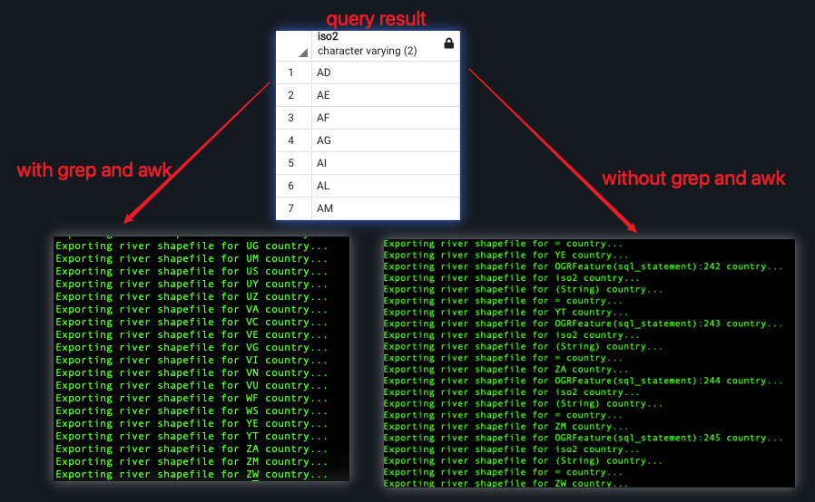

# Clipping geometries to deploy data
## Use Case
1. clipping a big dataset into small portions (subsets), with each perhaps representing an area of interest
2. Export the selected datasets as shapefiles

## Recipe
1. create a view to clip the river geometries for each country using the ST_Intersection and ST_Intersects functions
2. create scripts `export_rivers.sh` to export a rivers shapefile for each country

## Lesson Learnt
1. Clip one dataset from another using `ST_Intersects`
2. Create a batch script using:
    * `ogrinfo` with `-sql` option to query the unique country name
    * `grep` and awk` linux command to clean query result
    
    * `for-do-done` loop to iterated every country and 
    * `ogr2ogr` with `-sql` option to pull query result to a specific shapefile
