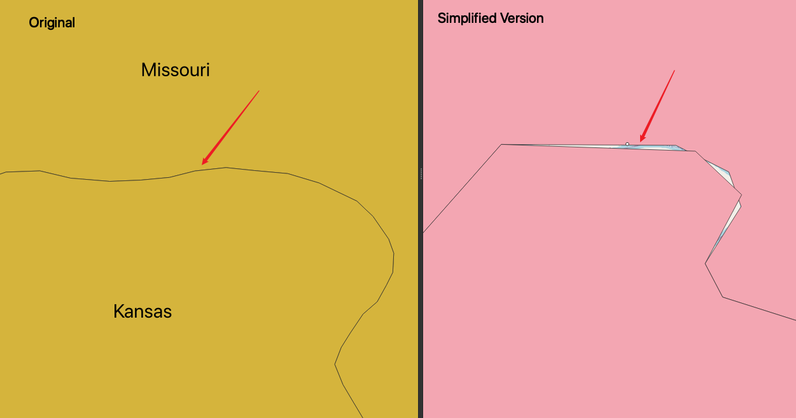

# Simplifying geometries
## Use Case
* To generate a less detailed or light version of a vector dataset

## Recipe
* `ST_SimplifyPreserveTopology`: reduce the vertex numbers comprised in a certain tolerance. 
* After the command, the polygons, in some cases, are not adjacent any more. It seems `ST_SimplifyPreserveTopology` only works well with linear features, but produces topological anomalies with polygons
  
* Alternative solution: 
    1. `GRASS v.generalize`. Pending issue here: the boundary after v.generalize is too flat
    2. `PostGIS topology`
## Lesson Learnt
*  Set the PostgreSQL search_path variable such that all your newly created
database objects will be stored in the chp03 schema, using the following code:

