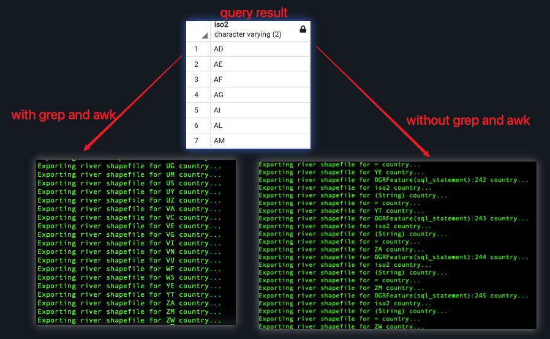

### Working with GPS data
  * Import GPS data which typically saved in a .gpx file
      * xml format
      * compose of just one <trk> element
      * the <trk> element contains many <trkpt> elements      
   
  
  * Test Spatial Query:
      * ST_MakeLine to generate polylines from point geometries, 
      * ST_Length to compute distance, 
      * ST_Intersects to perform a spatial join operation. 

### Fixing invalid geometries:
  *  Investigate whether or not any geometry is invalid in the table using ST_IsValid and ST_IsValidReason functions
  *  QGIS also has the similar function which can even highlight the faulty shape with a point. 
   

### GIS analysis with spatial joins:
  * ST_Intersects(pol1.geom, pt1.geom): points in polygon
  * ST_DWithin(geography(pt1.geom), geography(pt2.geom), 1): return if the distance between pt1 and pt2 is within 1m

### Simplifying geometries:
  * ST_SimplifyPreserveTopology: reduce the vertex numbers comprised in a certain tolerance. After the command, the polygons, in some cases, are not adjacent any more. It seems ST_SimplifyPreserveTopology only works well with linear features, but produces topological anomalies with polygons
  
  * Alternative solution: GRASS v.generalize
  * pending issue here: the boundary after v.generalize is too flat

### Measuring distances
 * ST_Distance: to calculate the distances
 * Introduce to Common Table Expression (CTE)
 * ST_DistanceSphere and ST_DistanceSpheroid: to calculate the distance under different CRS

### Merging polygons using a common attribute Computing intersections
* `ST_Union` acts as an aggregate function (such as SUM, COUNT, MIN and MAX) on the geometric field, using the common attribute in the `Group By` clause 

* As is shown, the function aggregate counties into states

### Compute Intersections
* Perform a self_spatial join useing `ST_Intersects`
* Find intersection in the join context with the `ST_Intersection`
* There are 3 geometry types of intersections:
  1. `ST_POINT`: two linear geometries intersect each other once
  2. `ST_MultiPoint`: two linear geometroes intersect each other multiple times
  3. `ST_GeometryCollection`: two multilinestring objects intetsect and share part of the line
* In case we only want to show points, we can use `ST_CollectionExtract` function in the context of a `SELECTCASE` statement.

### Clipping geometries to deploy data Simplifying geometries with PostGIS topology
**User Case**: 
1. clipping a big dataset into small portions (subsets), with each perhaps representing an area of interest

**Recipe**:
1. create a view to clip the river geometries for each country using the ST_Intersection and ST_Intersects functions
2. create scripts `export_rivers.sh` to export a rivers shapefile for each country

**Lesson Learnt**
1. Clip one dataset from another using `ST_Intersects`
2. Create a batch script using:
    * `ogrinfo` with `-sql` option to query the unique country name
    * `grep` and awk` linux command to clean query result
    
    * `for-do-done` loop to iterated every country and 
    * `ogr2ogr` with `-sql` option to pull query result to a specific shapefile

**code snippets**
1. sql/clipping.sql
2. ogr2ogr/export_rivers.sh

