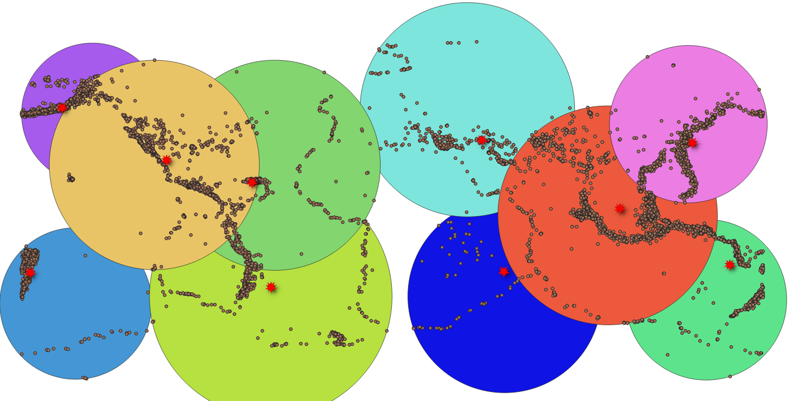

# Creating a fixed number of clusters from a set of points
## Use Case
Explore `ST_ClusterKMeans` function that:
1. aggregates geometries into k clusters
2. retrieves the id of the assigned cluster for each geometry in the input.

## Recipe
1. Create two new tables
     * `earth_cent`: contains the centroid geometries of the clusters and their IDs
     * `earth_circ`: contains the minimum bounding circle for each cluster 
2. Use `ST_ClusterKMeans` to into cast points into 10 cluster
```sql
(SELECT ST_ClusterKMeans(e.wkb_geometry, 10) OVER() cid, e.wkb_geometry ge 
FROM chp03.earthquakes e) tab
```
3. Use 'ST_UNION` to combine points with the same cid into one group
```sql
(SELECT ST_UNION(tab.ge) OVER (partition by tab.cid ORDER BY tab.cid) ge2, tab.cid
FROM tab) tab2
```
4. Use `ST_Centroid` to find centroid of each cluster
```sql
SELECT DISTINCT ST_SetSRID(ST_Centroid(tab2.ge2), 4326) centroid, tab2.cid  FROM tab2
```
5. Use `ST_MinimumBoundingCircle` to find centroid of each cluster
```sql
SELECT DISTINCT ST_SetSRID(ST_MinimumBoundingCircle(tab2.ge2), 4326) centroid, tab2.cid  FROM tab2
```

The minium bounding circle may overlapping but each point belongs to one and only one cluster

## Lesson Learnt

