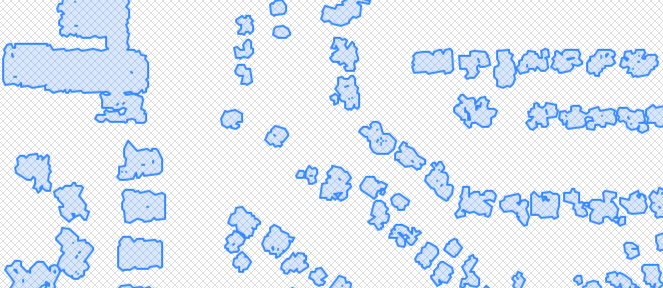
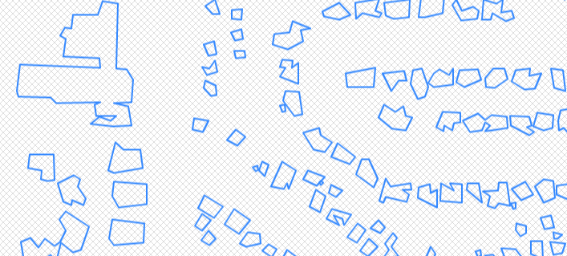

# Detailed building footprints from LiDAR
## Use Case
Frequently, with spatial analyses, we receive data in one form and then we need it in another more extensive form.

LiDAR devices typically return a cloud of points referencing absolute or relative positions in space.

This recipe develops a method to transform intensive LiDAR samples of buildings into extensive building footprints

## Recipe
1. A simple but lumpy method: ST_Union(ST_Buffer(geom, 5))
     * 
2. We will use `ST_Simplify_PreserveTopology` to:
     * Simplify the polygons 
     
     * Grab just the external ring to remove the internal holes
     
## Lesson Learnt

