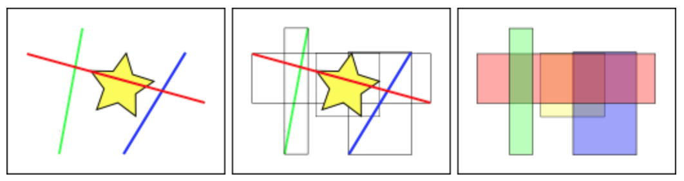
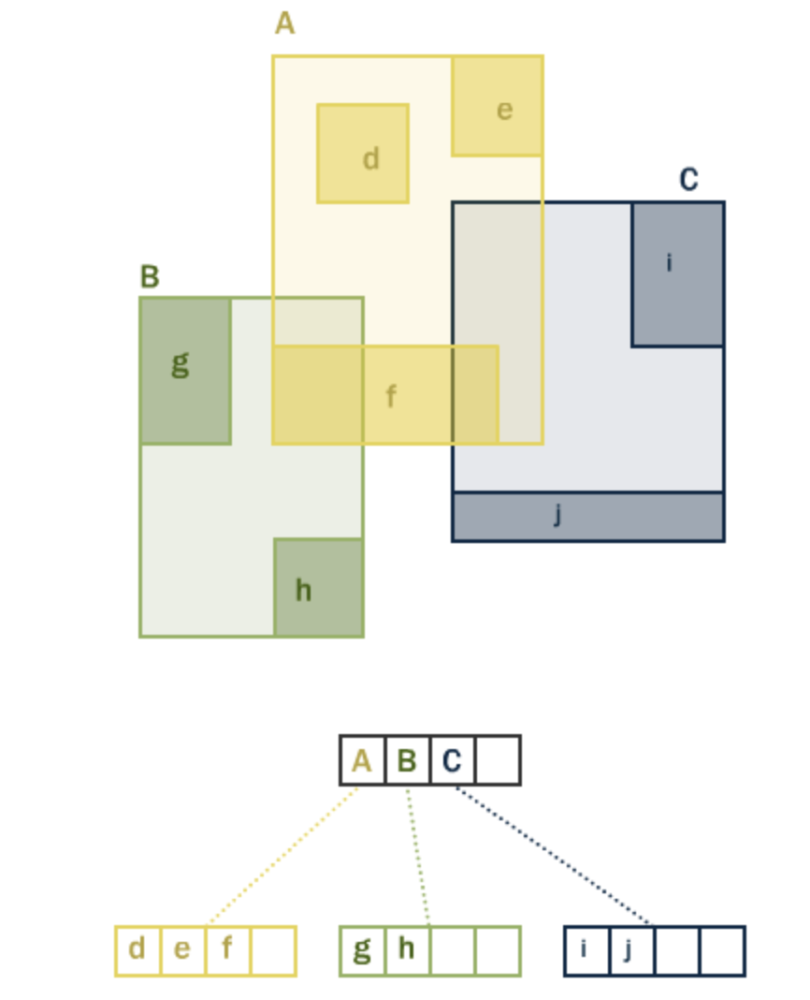

# Improving proximity filtering with KNN
## Use Case
* Which are the ten coffee shops closest to me?

## Recipe
* The naive approach: 
    1. transform this value into our local coordinate system
    2. compare the distance to each point in the database from the search point, 
    3. order those values by distance, and limit the search to the first 10 closest records 
* alternative approach: 
    1. only compare the point of interest to the ones known to be close by setting a search distance using the `ST_DWithin`
* knn approach:
    1. For PostGIS 2.0+ we can leverage the distance operators (`<->` and `<#>`) to do indexed nearest neighbor searches. 
    2. `<->` means “distance between box centers”
    3. `<#>` means “distance between box edges”

## Lesson Learnt
* spatial index is critical for the query performance

## How Spatial Indexes Work
Standard database indexes create a hierarchical tree based on the values of the column being indexed. 

Spatial indexes are a little different – they are unable to index the geometric features themselves and instead index the bounding boxes of the features.

In the figure above:
* The number of `lines` that intersect the yellow star is one, the `red line`. 
* But the `bounding boxes` of features that intersect the yellow box is two, the `red` and `blue` ones.

The way the database efficiently answers the question “what lines intersect the yellow star” is to:
* First answer the question “what boxes intersect the yellow box” using the index (which is very fast) 
* Then do an exact calculation of “what lines intersect the yellow star” only for those features returned by the first test.

For a large table, this “two pass” system of evaluating the approximate index first, then carrying out an exact test can radically reduce the amount of calculations necessary to answer a query.

## R-Tree Hierarchy
Both PostGIS and Oracle Spatial share the same `R-Tree` spatial index structure. 

R-Trees is a self-tuning index structure that automatically handles variable data density and object size. It breaks up data into:
* rectangles
* sub-rectangles
* sub-sub rectangles
* etc. 

