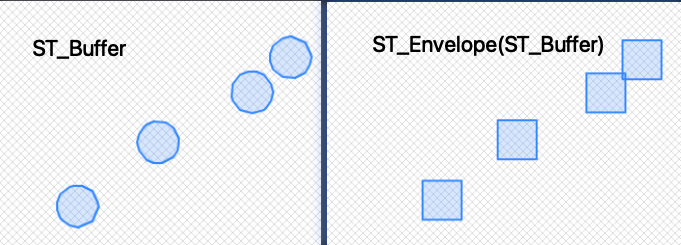
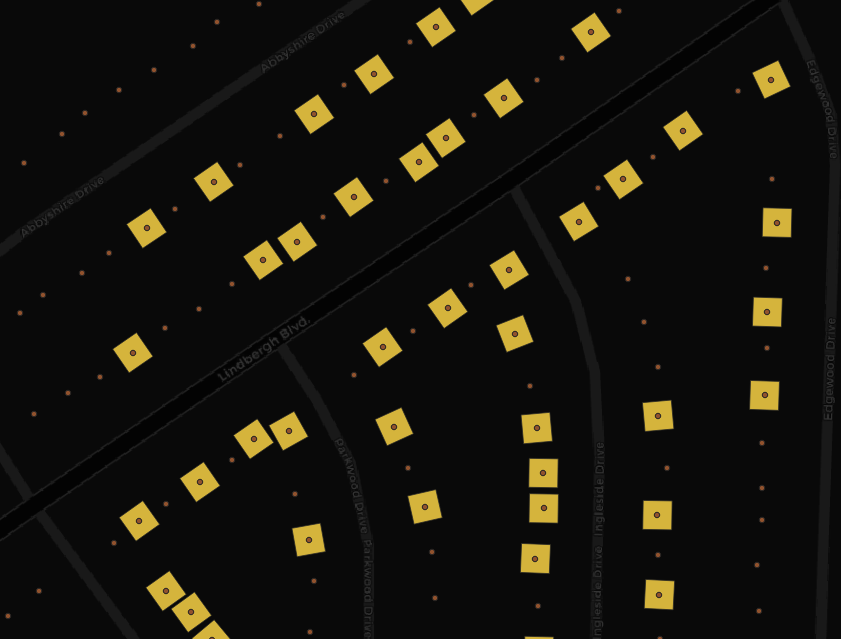

# Rotating geometries
## Use Case
Explore a simple example of using the ST_Rotate function to rotate geometries

## Recipe
1. Use `ST_Buffer(geom, 20)` to create a 20 feet buffer for each point
2. Use `ST_Envelop` function to create a square around the buffed area

3. Use `ST_Rotate` function
*   ST_Rotate(**geometry to rotate**, **angle**, **origin around which to rotate**)

## Lesson Learnt
1. `ST_Envelop` on top of ST_Buffer to create a grid, other than circle, diamond buffer zone

