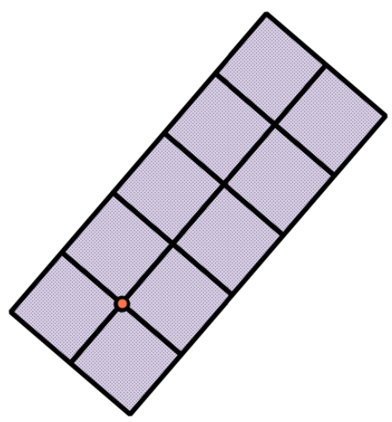
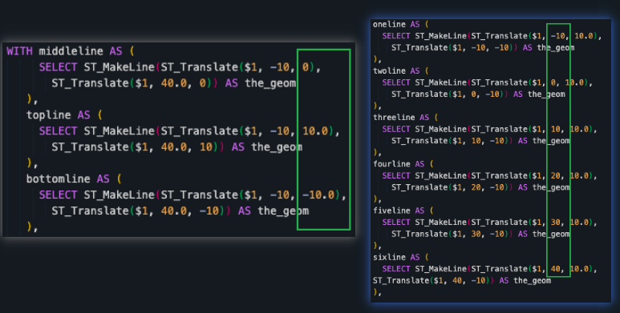
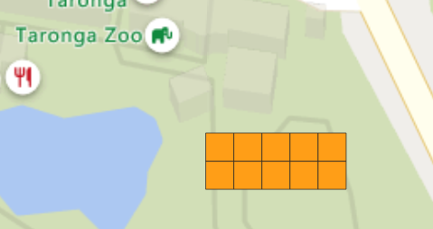

# Translating, scaling, and rotating geometries – advanced
## Use Case
Often, in a spatial database, we are interested in making explicit the representation of geometries that are implicit in the data

In the snapshot below, the explicit location is the dot, the implicit geometry is these purple grid which represent the extended field survey areas 



## Recipe
1. Construct the grid then rotate it in place
2. Use a series of `ST_MakeLine` and 'ST_Node` to flatten or node the results. This ensure all lines properly intersecting each other
3. `ST_Polygonize` will construct the multi-ploygon geometry.

## Lesson Learnt
The delta in create_gird function is 10, and it will associate with SRID. 

Hence:
1. In SRID 4326, the grid will be approx. 10 x 10 feet
2. In SRID 3857, the grid will be approx. 10 x 10 metre
```sql
-- This will create 10m x 10m grids near Taronga zoo
CREATE TABLE chp04.ev_grid AS
SELECT chp04.create_grid(ST_SetSRID(ST_MakePoint(16836335,-4007717),
     3857), 0) AS the_geom
```     

