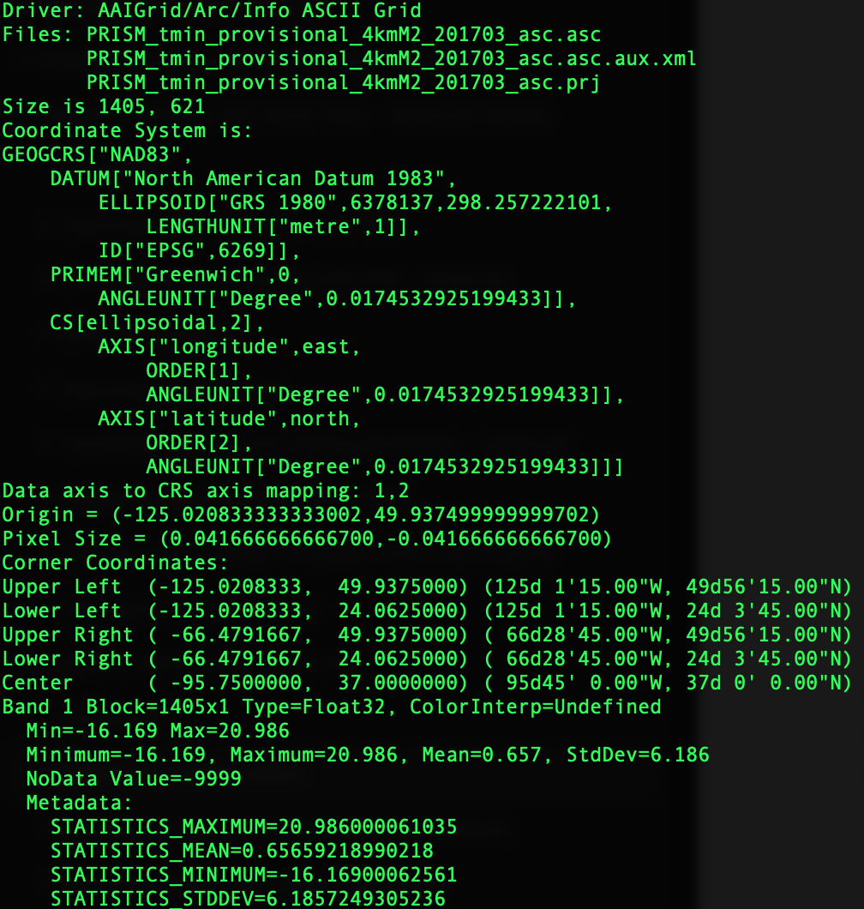

# Getting and loading rasters
## Use Case
A raster is a photograph or image to describe where to place the raster on the Earth's surface.

A raster has a set of values, each of which is known as a `brand`

A photograph has three set of brand(values): red, green and blue. 

We will load most of the rasters used by this chapter in this recipe


## Recipe

1. Use `gdalinfo` to check the metadata of a raster
```shell
gdalinfo PRISM_tmin_provisional_4kmM2_201703_asc.asc
```


2. Use `raster2pgsql` to load raster to postgis in a similar manner of `shp2pgsql`

## Lesson Learnt

