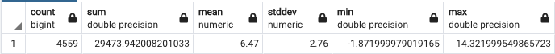

# Working with basic raster information and analysis
## Use Case
Explore the function that provides insight into raster dataset

## Recipe
1. Use `ST_Metadata` function to show metadata
2. Use `ST_BandMetadata` function to show band info only
3. Use `ST_SummaryStats` function for a basic statistics

## Lesson Learnt

